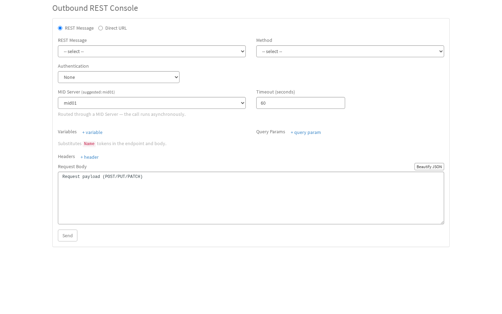
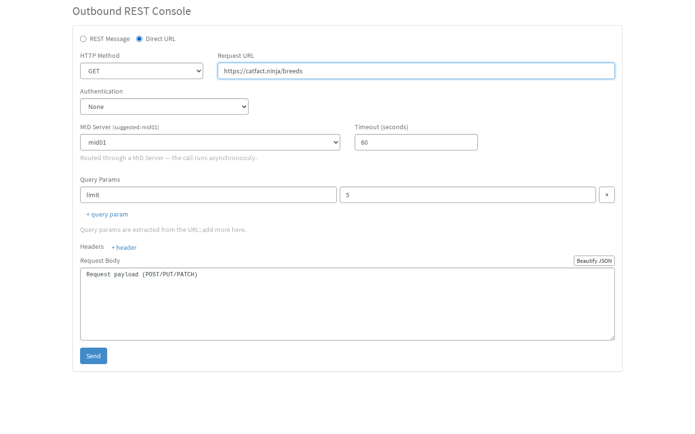
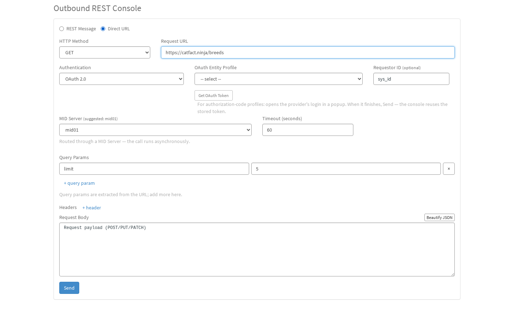
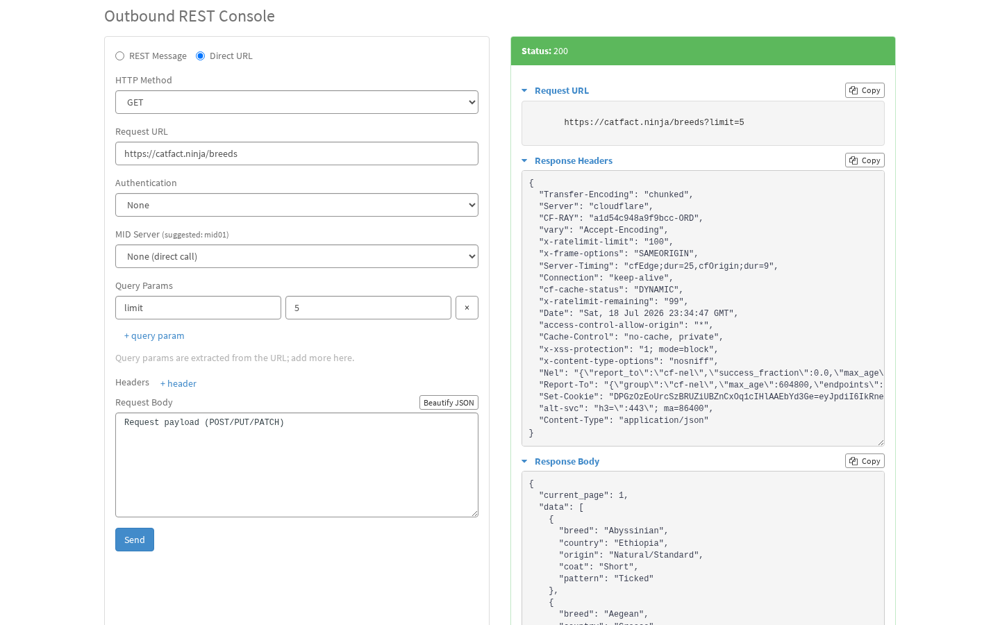
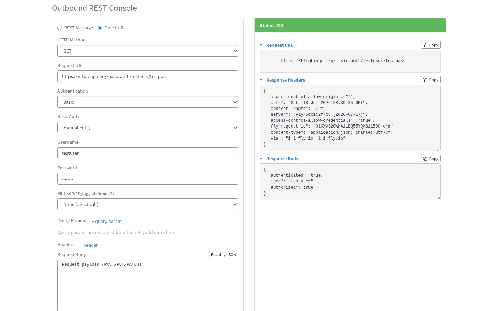
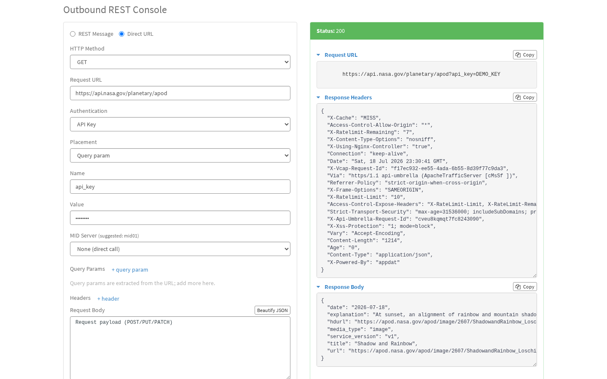
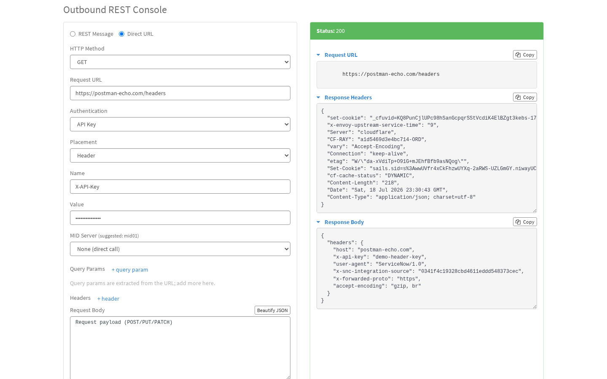
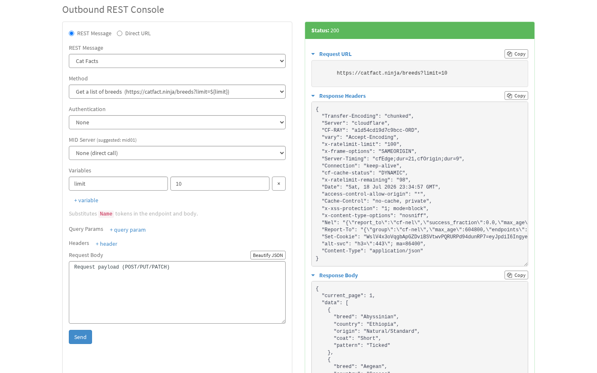
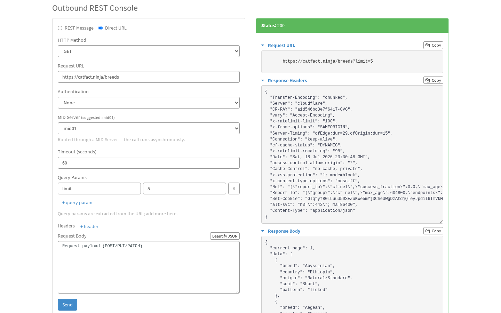
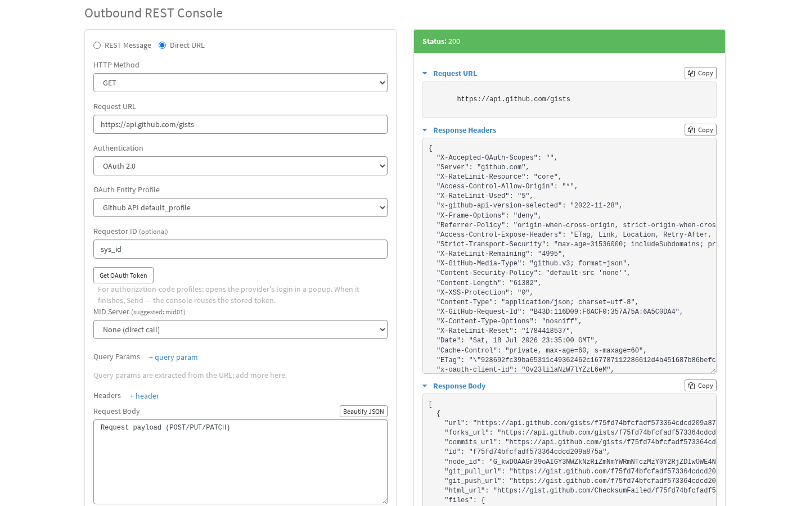

# ServiceNow Outbound REST Console

A Swagger-UI-style Service Portal widget for exercising existing Outbound REST Messages inside
ServiceNow, without saving records between runs. It supports Basic, API Key, and OAuth 2.0
authentication — and works around the platform limitation that **OAuth 2.0 cannot be sent through a
MID Server** by fetching the token in script and injecting it as a manual `Authorization` header.

> This tool executes existing REST Messages. It does **not** create or modify REST Message records.

## Screenshots

| Default view | Direct URL mode | OAuth 2.0 auth |
|---|---|---|
|  |  |  |

| A real response | Basic auth (live) | API key, query param (live) |
|---|---|---|
|  |  |  |

| API key, header (live) | REST Message mode (live) | MID Server routing (live) |
|---|---|---|
|  |  |  |

**OAuth 2.0, live** — GitHub's `authorization_code` profile, reusing the token minted by a prior
interactive consent (see [docs/free-test-apis.md](docs/free-test-apis.md)) to call `/gists`:



## Components

Built as a **now-sdk (ServiceNow Fluent) scoped application** — scope `x_1676196_rest_gui`. Each Fluent
definition (`*.now.ts`) references its co-located raw source via `Now.include()`.

| Fluent definition | Raw source | ServiceNow artifact |
|---|---|---|
| `src/fluent/script-include/rest-explorer-engine.now.ts` | `RestExplorerEngine.js` | Script Include `RestExplorerEngine` (server-side broker) |
| `src/fluent/sp-widget/rest_explorer/widget.now.ts` | `server_script.js`, `client_controller.js`, `widget.html`, `widget.css` | Service Portal widget `Outbound REST Console` (`sp_widget`) |
| `src/fluent/sp-page/rest-explorer-page.now.ts` | — | Service Portal page (`sp_page`, `?id=rest_explorer`) hosting the widget |
| `src/fluent/security/roles.now.ts` | — | Role `x_1676196_rest_gui.user` (`sys_user_role`) |
| `src/fluent/security/properties.now.ts` | — | System properties `default_mid_server`, `enable_direct_url`, `debug`, `sensitive_query_params` (`sys_properties`) |
| `src/fluent/table/audit-log.now.ts` | — | Table `x_1676196_rest_gui_audit_log` (`sys_db_object`), plus its read ACL |

No external JS/CSS libraries are required — JSON response bodies are pretty-printed in-controller
and rendered as plain text (no syntax highlighting), so there is no CodeMirror/Prism dependency
to wire up.

## Audit log

Every call made through the console — success, HTTP error, or refused/invalid — is written to
`x_1676196_rest_gui_audit_log` by the engine itself. It records who ran what, when, against which
endpoint, and how it turned out; it does **not** record response bodies or request/response headers
(so no Bearer token or Basic credential ever lands there).

- **Endpoint** is logged in full, including the query string, but with the values of any query
  parameter named in the `x_1676196_rest_gui.sensitive_query_params` property (default: the usual
  suspects — `api_key`, `token`, `secret`, `password`, etc.) replaced with `REDACTED`. An API key
  placed in the query string is redacted automatically even if its name isn't on that list.
- **Request body** is only recorded when the `x_1676196_rest_gui.debug` property is turned on
  (default off) — bodies can carry secrets a console like this shouldn't keep a second copy of.
- **Who can see what:** the `x_1676196_rest_gui.user` role only grants read access to rows the
  reader themselves created; admins can see every row.
- **Retention:** a Table Cleaner job purges rows after 14 days (matched on the row's creation date).

## Installation

Prerequisite: `npm install` (installs `@servicenow/sdk`). Authenticate the SDK to your instance
per the ServiceNow SDK docs before deploying.

1. **Build** the update-set XML: `npm run build` (emits to `dist/app/`).
2. **Deploy** to the instance: `npm run deploy` (`now-sdk install`). This creates the scoped app
   `x_1676196_rest_gui` with the role, property, Script Include, widget, and page — no manual copy/paste.
3. **Grant** the `x_1676196_rest_gui.user` role to whoever should use the tool. Admins are always allowed.
   The engine enforces the role server-side, so a direct widget call is refused too.

   > ⚠️ **Treat this role as admin-adjacent.** A holder can select *any* stored Basic Auth or
   > OAuth profile on the instance and point it at an arbitrary URL — including one they control —
   > exfiltrating the stored credential or token. They can also use the instance (or any MID
   > server) as a pivot to reach internal endpoints. That power is inherent to a REST console;
   > grant the role as carefully as you would admin.
4. Open the page at `/<portal>?id=rest_explorer` (any Service Portal), or drop the `Outbound REST Console`
   widget onto a page of your choosing.
5. *(Optional)* system properties, all under **System Properties** on the installed scope:
   - `x_1676196_rest_gui.default_mid_server` — fallback MID server name suggested when
     auto-selection returns nothing.
   - `x_1676196_rest_gui.enable_direct_url` — turn off Direct URL mode to restrict the console to
     vetted REST Message records only. Admin-write.
   - `x_1676196_rest_gui.debug` — turn on to also capture request bodies in the audit log. Off by
     default since bodies can carry secrets. Admin-write.
   - `x_1676196_rest_gui.sensitive_query_params` — comma-separated, case-insensitive query
     parameter names to redact from audit log URLs; setting it **replaces** the built-in default
     list rather than adding to it. Admin-write.

## Testing

`npm test` runs a Node unit suite (`node --test`, no dependencies) for the `RestExplorerEngine`
Script Include. It loads the raw engine into a `vm` sandbox with mocked Glide globals — no instance
required — and covers auth branching (basic profile/manual, API key, OAuth), the OAuth token-refresh
path including routing the token request itself through the MID server, the cross-scope function
resolve (by sys_id and by name), MID-server async routing and timeouts, validation, and response
normalization. The suite runs automatically before every `npm run build` (via the `prebuild` hook),
so a failing test blocks the build. Build through `npm run build` rather than bare `now-sdk build`
so the tests run.

### Screenshots

Playwright can capture the live widget in Service Portal for sharing in PRs or docs. This is **not**
part of `npm test` — it requires a deployed instance and credentials.

```bash
# First-time only: install the Chromium browser binary.
npm run screenshots:install

# Copy the template and add your instance credentials.
# .env is gitignored and must never be committed.
cp .env.example .env
# edit .env

npm run screenshots
```

Captured images:

- `screenshots/rest-explorer-default.png` — REST Message builder mode.
- `screenshots/rest-explorer-direct-url.png` — Direct URL builder mode.
- `screenshots/rest-explorer-oauth.png` — OAuth 2.0 profile picker visible.

Credentials come from a `.env` file (or exported environment variables):
`SN_INSTANCE`, `SN_USERNAME`, `SN_PASSWORD`. Optional: `SN_PAGE_ID`
(default `rest_explorer`), `SN_PORTAL` (default `/`).

## Using it

1. Pick a **REST Message** and one of its **HTTP Methods**.
2. Choose **Authentication**: None, Basic (pick a Basic Auth profile), API Key (header or query
   param), or OAuth 2.0 (pick an OAuth Entity Profile; optionally a requestor sys_id).
3. Optionally pick a **MID Server** — required to reach firewalled endpoints. Selecting one makes the
   call asynchronous and reveals a **Timeout (seconds)** field (default 60) for how long to wait for
   the MID response. Leave it on *None (direct call)* for public endpoints.
4. Fill in request data, then **Send**:
   - **REST Message mode:** **Variables** substitute `${name}` tokens in the endpoint and body. They
     prefill from the function's stored variable substitutions (`sys_rest_message_fn_parameters`). Add
     explicit **Query Params** to append `&key=value` pairs to the URL. The function's own *HTTP Query
     Parameters* related list (`sys_rest_message_fn_param_defs`) is also applied automatically.
   - **Direct URL mode:** type the full URL. Any query string you paste (e.g. `?limit=10`) is extracted
     into the **Query Params** section and removed from the URL field; add more params there. The
     **Variables** section is hidden because direct URLs do not use `${token}` substitution.
   - Add **Headers** and a **Request Body** as needed.
   - The response panel shows status, the actual **Request URL** sent (with substitutions and appended
     query params), response headers, and a pretty-printed body.
5. In the response panel, the **Request URL**, **Response Headers**, and **Response Body** sections each
   collapse (click the heading) and carry a **Copy** button that puts that section's text on the clipboard.

## Verification still required on a live instance

Deployed to a dev instance; the no-auth path (both a saved REST Message and a direct URL) has been
exercised end to end. The engine logic is covered by `npm test`, but these still need live confirmation:

1. ~~`RestExplorerEngine.execute(config)` against a real endpoint for **Basic**, **API key**, and
   **OAuth**~~ — all three confirmed live: see the screenshots above (`httpbingo.org/basic-auth`
   returning `authenticated: true`; `api.nasa.gov`'s APOD endpoint and `postman-echo.com/headers`
   for query-param and header API keys; GitHub's `/gists` via the `Github API default_profile` OAuth
   Entity Profile, reusing a token from a prior interactive consent). Still open: a stored **Basic
   Auth profile** (only manual-entry Basic has been exercised live) and headless OAuth token minting
   (`client_credentials` — the GitHub profile only proved the stored-token-reuse branch, since GitHub
   supports only `authorization_code`). Free public endpoints for each auth type are catalogued in
   [docs/free-test-apis.md](docs/free-test-apis.md).
2. **The OAuth-through-MID path** — a manual Bearer header + `setAuthenticationProfile('no_authentication')`
   against a MID-routed internal endpoint. This uses an *undocumented* auth value and is the one
   load-bearing, unverified call. (MID-routing itself — `executeAsync()` + `waitForResponse()` against
   `mid01` — and OAuth 2.0 itself are each now confirmed live independently, see the screenshots above;
   it's specifically the *combination* of the two that remains unverified.)
3. ~~`ecc_agent.status=Up` for the MID-server list~~ and ~~`sys_rest_message_fn.function_name` /
   `.http_method` / `.rest_endpoint` / `.rest_message`~~ — both confirmed live (the MID Server and
   REST Message screenshots above). `sys_auth_profile_basic` is still unconfirmed — see point 1.
4. ~~The widget in Service Portal: dropdowns populate, Send does not reload the page, and the response
   body pretty-prints JSON~~ — confirmed live (see screenshots above). Other content types rendering as
   raw text is still unverified (only JSON responses have been exercised so far).
5. ~~Response headers actually populate in the response panel~~ — confirmed live; `getHeaders()`
   enumerates correctly on this instance (see screenshots above), so the `getAllHeaders()` fallback
   path remains unexercised.
